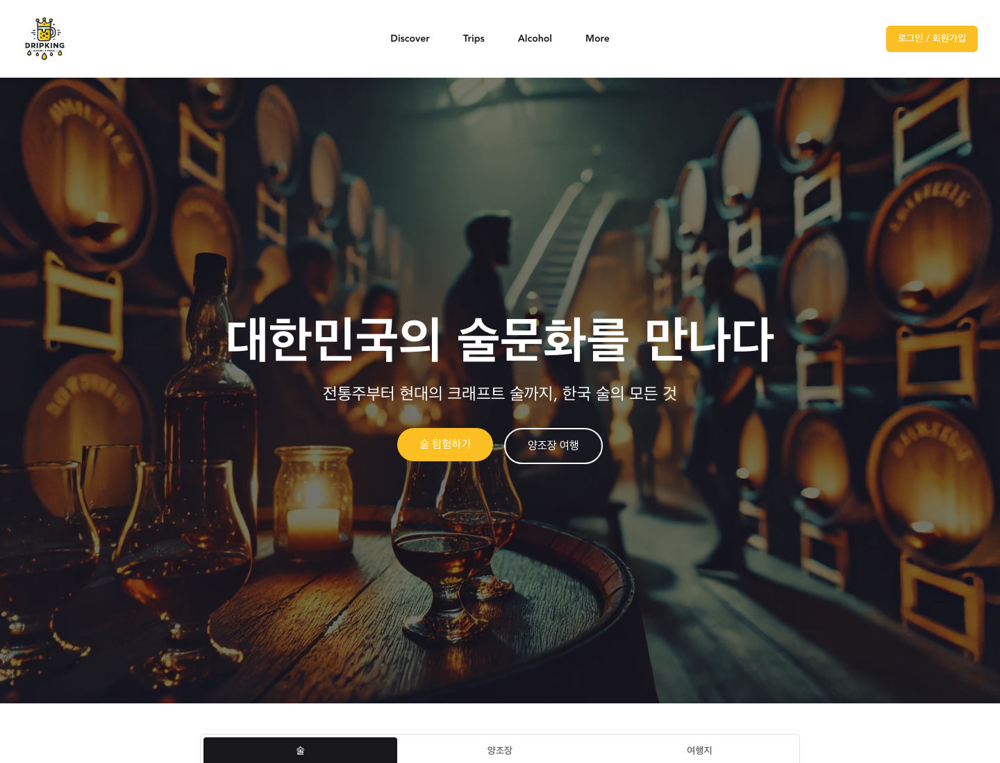
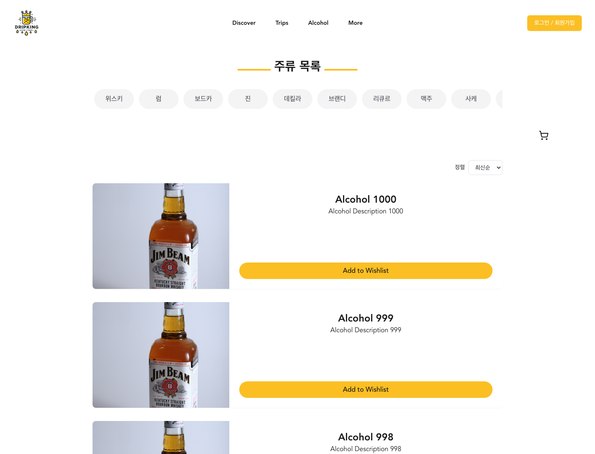
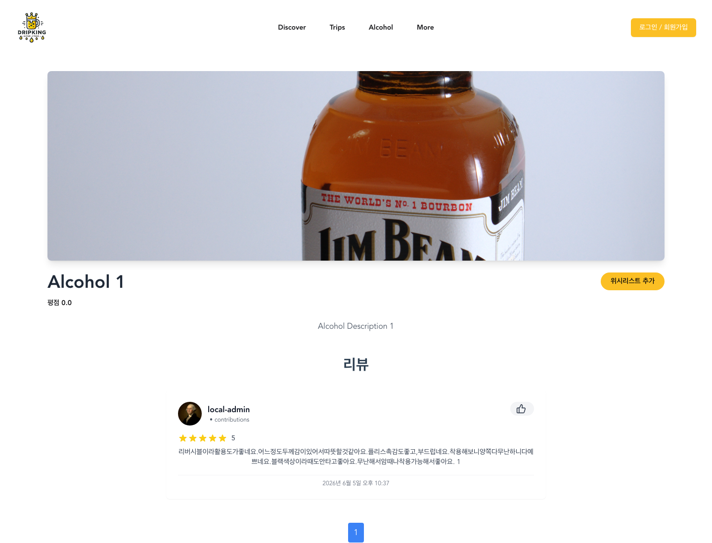
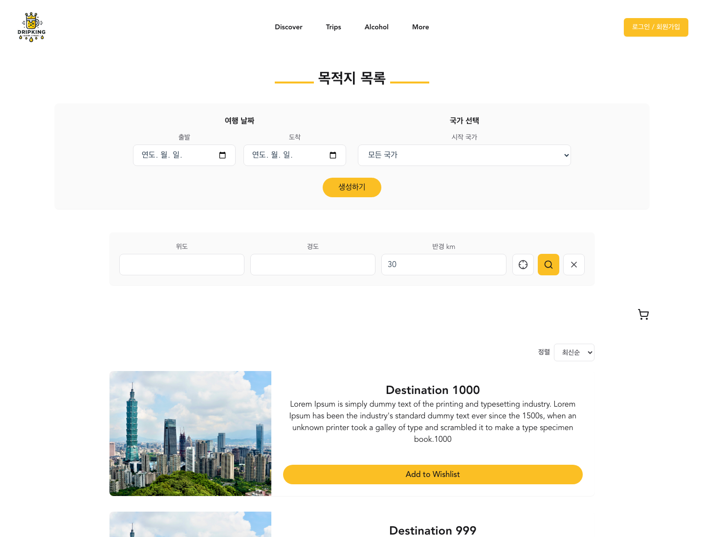

# Dripking Frontend

술, 양조장, 여행지를 탐색하고 관심 항목을 여행 일정으로 구성하는 Dripking의 Vue 3 프론트엔드입니다.

이 저장소는 프론트엔드만 포함합니다. 백엔드 API는 같은 상위 워크스페이스의 `../Dripking/`에 별도 Git 저장소로 관리됩니다.

## 프로젝트 소개

Dripking은 술과 여행을 좋아하는 사용자가 술 테마 콘텐츠를 발견하고 실제 여행 계획으로 이어갈 수 있도록 만든 웹 서비스입니다.

프론트엔드는 사용자가 아래 흐름을 한 화면 경험 안에서 이어가도록 구성합니다.

1. 랜딩 페이지에서 인기 여행지와 인기 술을 확인합니다.
2. 술, 양조장, 여행지 목록을 탐색하고 상세 정보를 확인합니다.
3. 관심 항목을 위시리스트에 저장합니다.
4. 위시리스트 항목을 여행 일정에 추가합니다.
5. 지도와 일정 목록을 보며 여행 계획을 수정합니다.
6. 리뷰를 작성하거나 신고하고, 관리자는 신고와 콘텐츠를 검수합니다.

## 화면 미리보기

아래 이미지는 로컬 개발 환경의 seed data를 기준으로 캡처한 예시 화면입니다.









## 프론트엔드 역할

- 공개 사용자의 콘텐츠 탐색 경험 제공
- 술, 양조장, 여행지 목록/상세 화면 제공
- 인기 콘텐츠, 검색, 필터, 정렬 UI 제공
- 비로그인 사용자의 로컬 위시리스트와 여행 계획 저장
- 로그인 후 위시리스트, 여행, 일정 데이터를 서버와 동기화
- Dragula 기반 위시리스트 -> 일정 드래그 앤 드롭
- Google Maps 기반 지도 탐색과 일정 위치 표시
- JWT 인증 상태에 따른 사용자/관리자 라우팅
- 관리자 대시보드, 사용자 관리, 카테고리 관리, 콘텐츠 관리, 리뷰 검수 화면 제공

## 주요 화면

| 화면 | 역할 |
| --- | --- |
| `/` | 랜딩, 검색, 인기 여행지/인기 술 |
| `/destinationList` | 여행지 목록, 필터, 지도 기반 탐색 |
| `/destination/:id` | 여행지 상세, 리뷰, 관련 정보 |
| `/distilleryList` | 양조장 목록과 지도 탐색 |
| `/distillery/:id` | 양조장 상세와 관련 술 정보 |
| `/alcoholList` | 술 목록과 카테고리 탐색 |
| `/alcohol/:id` | 술 상세, 리뷰, 위시리스트 |
| `/trip/:id` | 여행 일정 편집, 위시리스트 드래그 앤 드롭, 지도 |
| `/editUserDetail` | 사용자 프로필과 비밀번호 관리 |
| `/dashboard` | 관리자 운영 요약과 인기 신호 |
| `/userDashboard` | 관리자 사용자 관리 |
| `/categoryDashboard` | 관리자 카테고리 관리 |
| `/reviewModeration` | 관리자 리뷰 신고 검수 |
| `/productsFormView` | 관리자 술/양조장/여행지 콘텐츠 관리 |

## 핵심 구현 포인트

| 구현 영역 | 설명 |
| --- | --- |
| 게스트 우선 경험 | 비로그인 상태에서도 위시리스트와 여행 계획을 로컬 스토리지에 저장합니다. |
| 로그인 후 동기화 | 로그인 성공 후 로컬 위시리스트, 여행, 일정 데이터를 서버 저장 흐름으로 연결합니다. |
| 일정 편집 | 위시리스트 항목을 일정으로 추가하고 Dragula로 순서를 조정합니다. |
| API 계약 관리 | 공통 `apiService`가 API base URL, 토큰 헤더, HTTP 메서드, 응답 파싱을 담당합니다. |
| 권한 라우팅 | Vue Router guard가 사용자/관리자 접근 권한을 확인합니다. |
| 지도 UI | Google Maps 기반 지도 컴포넌트로 여행지, 양조장, 일정 위치를 보여줍니다. |
| 인기 신호 UI | 7일, 30일, 전체 기간별 인기 여행지와 인기 술을 보여줍니다. |
| 관리자 화면 | 운영 지표, 콘텐츠 관리, 사용자 관리, 리뷰 검수 흐름을 제공합니다. |

## 기술 스택

| 영역 | 기술 |
| --- | --- |
| Framework | Vue 3 |
| Build | Vue CLI |
| Routing | Vue Router |
| State | Pinia |
| API | Fetch, Axios dependency |
| UI | Tailwind-related tooling, Headless UI, Heroicons, Font Awesome, Lucide |
| Map | vue3-google-map |
| Drag and Drop | Dragula |
| Static Hosting | Vercel/Netlify-compatible static build |

## 빠른 실행

```sh
cd Dripking_front
npm install
npm run serve
```

개발 서버는 `http://localhost:3000`에서 실행됩니다. 백엔드 API 주소는 `.env` 또는 `.env.example`의 `VUE_APP_API_URL`로 설정합니다.

로컬 백엔드와 함께 실행할 때는 `VUE_APP_API_URL=http://localhost:8080/api`를 사용합니다.

## 검증

```sh
cd Dripking_front
npm run lint
npm run build
```

백엔드 API 계약을 함께 바꾼 경우 `../Dripking/`의 DTO, controller, service와 프론트 API 호출부를 함께 확인합니다.

## 문서 안내

- `docs/PRD.md`: Dripking 프론트엔드가 제공하는 사용자 경험과 화면 흐름
- `docs/deployment.md`: 정적 호스팅과 라우터 fallback 기준
- `../Dripking/README.md`: 백엔드 API 소개
- `../agents/specs/product-spec.md`: 상위 워크스페이스의 제품 방향과 MVP 범위
- `../agents/specs/api-contract.md`: 백엔드와 프론트엔드 API 계약 기준

배포 문서는 운영 참고용입니다. 채용 또는 포트폴리오 검토자가 처음 읽을 문서는 이 README와 `docs/PRD.md`를 기준으로 정리했습니다.
